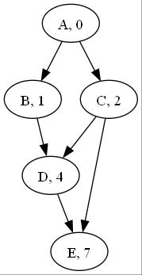

# Graph Processor

## Introduction

This program reads a graph from an input file, performs a breadth-first search (BFS) traversal on the graph, and generates a visualization of the graph in the DOT format.

## Program Structure

The program consists of a C++ source file named `main.cpp` and includes the following key components:

- **Main Function**: `main(int argc, char* argv[])`: The program's entry point, responsible for parsing command-line arguments, reading the input graph, performing BFS, generating a DOT file, and displaying a completion message.

- **Error Handling**: The program checks for command-line argument errors and input file availability, providing appropriate error messages and exiting when necessary.

- **Graph Processing**: The program uses the `Graph` class to read and process the input graph. It performs a BFS traversal on the graph to explore its structure.

- **Graph Visualization**: After BFS traversal, the program generates a visualization of the graph in the DOT format.

## Program Execution

The program executes the following steps:

1. **Command-Line Arguments**: It expects exactly one command-line argument, which is the name of the input file containing the graph data. If the argument count is incorrect, it displays a usage error and exits.

2. **Input File Validation**: The program attempts to open the input file specified by the command-line argument. If the file is not found or cannot be opened, it displays an error message and exits.

3. **Graph Processing**: The program uses the `Graph` class to read the graph data from the input file and construct the graph structure.

4. **BFS Traversal**: It performs a breadth-first search (BFS) traversal on the graph to explore its vertices and edges.

5. **Graph Visualization**: After BFS traversal, the program generates a DOT file that represents the graph's structure and connections. The DOT file is named after the input file with a ".dot" extension.

6. **Completion Message**: The program displays "The End." to indicate the successful completion of the processing.

## Usage

To use this program for graph processing and visualization, follow these steps:

1. **Compile the Program**:

```bash
g++ main.cpp Graph.cpp -o graph_processor
```

2. **Run the Compiled Program**: Execute the compiled program and provide the name of the input file containing the graph data as a command-line argument. For example:

```bash
./graph_processor input_graph.txt
```

Replace `input_graph.txt` with the actual name of your input file.

3. **Graph Processing**: The program will read the input graph, perform BFS traversal, and generate a DOT file representing the graph structure.

4. **Visualization**: You can use DOT-compatible software (e.g., Graphviz) to visualize the generated DOT file. For example:

```bash
dot -Tpng input_graph.txt.dot -o graph.png
```

Replace `input_graph.txt.dot` with the generated DOT file and `graph.png` with the desired output image file.

5. **Analysis**: You can analyze the graph's structure and the results of the BFS traversal based on the generated visualization.

6. **Note**: Ensure that the input file is correctly formatted according to the program's expectations.

## Output

**Terminal**:
```bash
$ ./graph_processor input_graph.txt
The End.
```

**Dot file visualization**:



## Comments and Notes

- The program is designed to process and visualize graphs based on the input file's data.

- Collaborator information is provided at the beginning of the file to indicate collaboration on the project.

## Conclusion

This program serves as a tool for reading, processing, and visualizing graph data. It uses breadth-first search (BFS) to explore the graph and generates a DOT file for easy visualization using external tools.