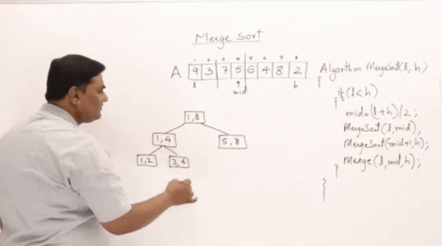
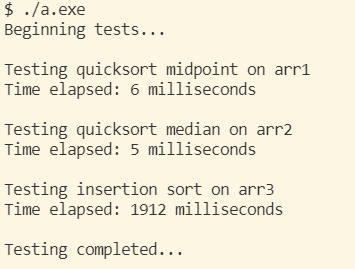

# Data Structures and Algorithms

This repository contains a collection of labs and programs pertaining to the fundamental study of data structures and algorithms during my undergraduate studies. Each folder contains a README.md file that gives a brief overview of either what was studied or what was implemented.

## List of PROGRAMS:
1. [Josephus Game Program](2.%20Algorithm%20Analysis%20&%20Lists%20+%20P1/PROGRAM%201%20files)
2. [BST Implementation and Testing](4.%20Trees%20(BST)%20+%20P2/PROGRAM%202%20files)
3. [Word Frequency and Hash Code Generation](9.%20Graphs,%20Adjacency%20Lists%20&%20Matrices%20+%20P3/PROGRAM%203%20files)

## List of labs:
1. **[Object-Oriented Programming Review](1.%20OOP%20Review)**
    - [Music Playlist Manager](1.%20OOP%20Review/Lab%20files)
2. **[Algorithm Analysis & Lists](2.%20Algorithm%20Analysis%20%26%20Lists%20%2B%20P1)** 
    - [IntList Functionality Testing](2.%20Algorithm%20Analysis%20%26%20Lists%20%2B%20P1/Lab%202%20files)
3. **[Stacks, Queues, Exceptions, Templates](3.%20Stacks%2C%20Queues%2C%20Exceptions%2C%20Templates)**
    - [Selection Sort and Exception Handling Program](3.%20Stacks%2C%20Queues%2C%20Exceptions%2C%20Templates/Lab%203%20files)
    - [Word Ladder Solver](3.%20Stacks%2C%20Queues%2C%20Exceptions%2C%20Templates/Word%20Ladder)
4. **[Trees (BST)](4.%20Trees%20(BST)%20+%20P2)**
    - [Stack Functionality Testing](/4.%20Trees%20(BST)%20+%20P2/Lab%204%20files)
5. **[Heaps & Advanced Sorting](5.%20Heaps%20&%20Advanced%20Sorting)**
    - [Printer Priority Queue (Heap) Program](5.%20Heaps%20&%20Advanced%20Sorting/Lab%205%20files)
6. **[Balanced Trees](6.%20Balanced%20Trees)**
    - [Arithmetic Expression Parser](6.%20Balanced%20Trees/Lab%206%20files)
7. **[AVL Trees](7.%20AVL%20Trees)**
    - [AVL Tree Program](7.%20AVL%20Trees/Lab%207%20files)
8. **[Hashing, Chaining, and Probing](8.%20Hashing,%20Chaining,%20Probing)**
    - [Movie Review Sentiment Analyzer](8.%20Hashing,%20Chaining,%20Probing/Lab%208%20files)
9. **[Graphs, Adjacency Lists & Matrices](9.%20Graphs,%20Adjacency%20Lists%20&%20Matrices%20+%20P3)**
    - [Quicksort and Insertion Sort Performance Analysis](9.%20Graphs,%20Adjacency%20Lists%20&%20Matrices%20+%20P3/Lab%209%20files)
10. **[DAGs, MSTs, all-pair shortest paths](9a.%20DAGs,%20MSTs,%20APSP/Lab%2010%20files)**
    - [Graph Processor](/9a.%20DAGs,%20MSTs,%20APSP/Lab%2010%20files)

### Program Sample (lab 9):

